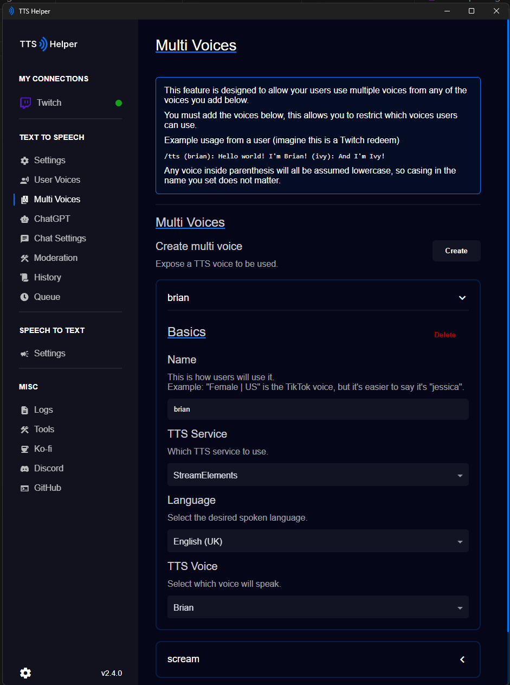

# Multi Voices

Have you heard about **TTS Monster**? Well, they wouldn't give me a dev key, so here's my attempt at trying to mimic them but with all the TTS Services that are available in **TTS Helper**.

Essentially, you, as the streamer, setup what voices your viewers can use when making a TTS request, be that through your **chat command** or through the **TTS redeem** you setup in `Text to Speech > Settings`. 

Here's how a user may use it (via chat commands)
> !say Hello I'm the default voice (brian): Hello I'm Brian (scream): Hello, I'm scream from TikTok (default): and we're back to default

`(default)` will always associate with the TTS you have selected in `Text to Speech > Settings`, anything else must be set or else it'll assume to `default`.

The **Name** field is a field you must set. The TTS services we support may have conflicting names or even long or weird names.

**It's up to you as the streamer to name these voices and supply them to your viewers as to make it easy for them to use.**

