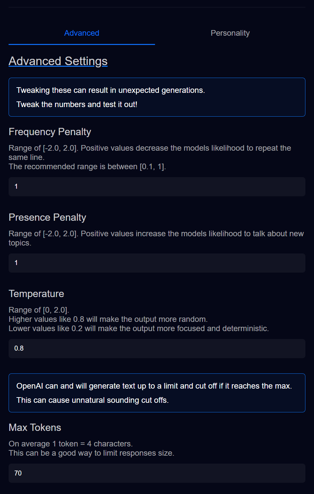

# ChatGPT Advanced Properties

The "**Advanced Settings**" for ChatGPT are just numbers we can tweak to try and get preferred responses back from **OpenAI**.

These inputs come with subtext to describe them already, so I'll just regurgitate them here.
- **Frequency Penalty**: This controls the likelihood that the model repeats a previously generated line.
  - Positive values **decrease** the likelihood of lines being repeated. The higher the more random sentences become.
  - `[-2.0, 2.0]` is the range, however, it is recommended to be between `[0.1, 1]`
- **Presence Penalty**: This controls the likelihood to talk about new topics.
  - Positive values **increase** the likelihood of the topic changing. The higher the more sporadic topic changing becomes.
  - `[-2.0, 2.0]` is the range, no recommended values as far as I know. I use `1`.
- **Temperature**: This controls of "focused" the model becomes when generating responses.
  - Higher values like `0.8` will make the output **more** random.
  - Lower values like `0.2` will make the output **more** focused and deterministic.
- **Max Tokens**: This is sorta like a "character limit" and controls how large the generated response is.
  - "On average" 1 token = 4 characters. This isn't set in stone anywhere.
  - If the max is too low, it can sometimes generate a response that gets cut off.
  - **I don't recommend going over 100 personally**

