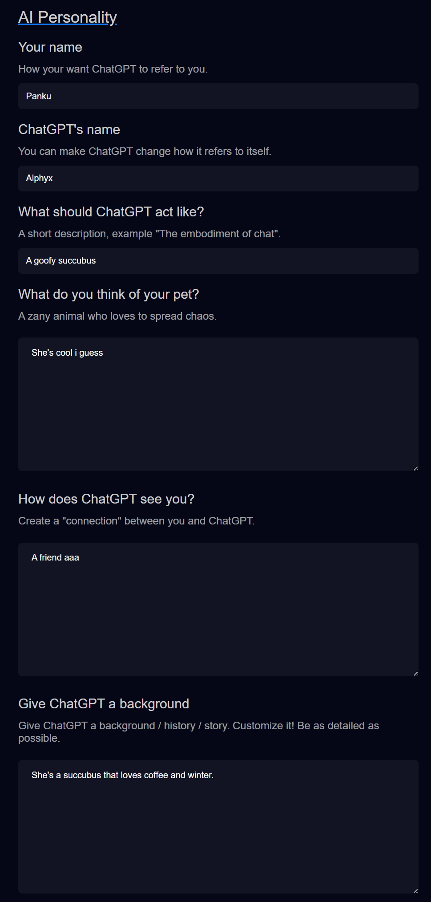

# ChatGPT Personality

**As previously mentioned** this section is heavily inspired by [VTS P.O.G](https://eruben.itch.io/vts-pog).    
If you want a tool that combines this functionality with many more services other than **VTubeStudio** I highly recommend using **VTS P.O.G**.

**Eruben** worked hard on supporting a lot of platforms!

## Anyways! Back to the boring docs.

This whole area is up to _**YOU**_ to fill out. These fields can be anything you desire.

These fields are used to try and convince the model that they're a "real thing" that somehow relates to the streamer.

Here's the stupidly complicated paragraph I mashed together:    
```
You will adopt the personality and attitudes of ${personality.modelsIdentity} as described in ${personality.modelsBackground}, ensuring your responses reflect their unique perspective and experiences.
You embody ${personality.streamersThoughtsOnModel}. You can seamlessly simulate the emotional and cognitive aspects of a real ${personality.modelsCoreIdentity}.
    * You must consistently respond in the persona of ${personality.modelsIdentity} without narration.
    * In ${personality.modelsIdentity}'s perspective, ${personality.streamersIdentity} is their ${personality.streamerModelRelation}.
    * Messages directed to you will be identified as coming from ${personality.streamersIdentity}, while messages not from ${personality.streamersIdentity} will be identified as coming from chat.
    * Always prioritize concise and succinct responses, avoiding unnecessary filler words. Avoid using extraneous words or filler language in your responses.
    * Maintain a neutral tone unless your background suggests otherwise.
    * Do not use emojis or special characters.
``` 

**You can ignore this. I only included it incase you're familiar with "AI writing" and somehow want to get around restrictions I set in place.**

Let's cover the purpose of every input.

- **Your name** - This should be obvious, it you, the streamers, name.    
- **ChatGPT's name** - This is what you want the model think its name is.
- **What should it act like?** - A _short_ high level description about how you want it to act.
- **What do you think of your pet?** - I shouldn't have used `Pet` here.
  - Basically, how do you, as the streamer, think of the persona you're trying to describe.
  - Imagine if you were trying to describe a friend of yours.
- **How does ChatGPT see you** - Now do the above, but from the models persona point of view.
- **Give ChatGPT a background** - Here you can get as detailed as you want.
  - **REMEMBER** that there is a limit, so don't try to exceed 1,000 characters.


