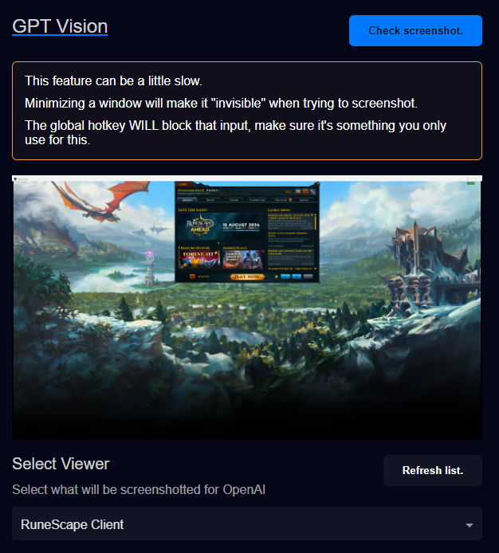

# ChatGPT Vision

> The images generated here are sent to **OpenAI** to get a response generated that is then sent **to the TTS service you've selected**.
> 
> **TTS Helper** doesn't store these images anywhere, and they're forgotten once given to **OpenAI**.

GPT Vision allows _you_ to select which monitor, or application, that you want screenshotted and sent to OpenAI for responses.

When you've selected a "viewer", you can click `Check screenshot` to confirm the viewer you selected is the one you want to use later on.

When you hit the hotkey, it may take up to 10seconds, depending on how OpenAI and your selected TTS service feel, to generate a response.

If you've opened up the application you wanted to capture **AFTER** you opened **TTS Helper** then you can click the button `Refresh list` so update the list of viewers.

Here's what the following inputs are for:
- **Select Viewer**: This is where you decide what gets captured. Select either the application or the display you want captured.
- **Global hotkey**: Currently, the only way to trigger this functionality is using a global hotkey.
  - These hotkeys **WILL** block input, make it something you wouldn't use normally.
- **Prompts for image generation**: A comma delimitated list of phrases that will be picked at random when "asking" OpenAI about the image.

