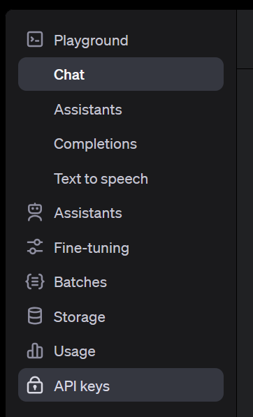
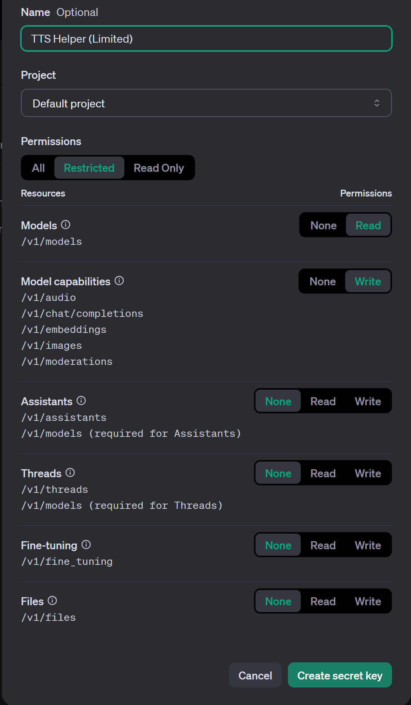
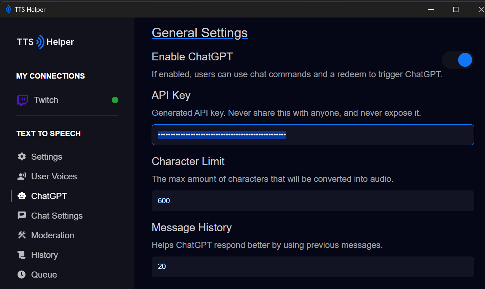
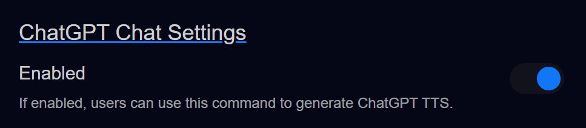
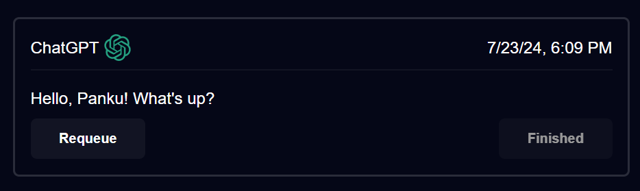

# OpenAI (ChatGPT)

# ⚠️⚠️⚠️ BEFORE YOU CONTINUE ⚠️⚠️⚠️
### **TTS Helper** does not run an AI model on your machine.    
When you use **OpenAI**'s "ChatGPT" model, you are creating an account with **OpenAI** and using the API token generated by them.   

**TTS Helper** uses this token to communicate with **OpenAI** to generate responses.

Using any **OpenAI** model cost money, each model charges differently. 

**_HOWEVER_**, these models are extremely affordable and you should not expect to spend more than $5 (USD) per month, unless you are making frequent, consistent requests for TTS (ex: you are a popular streamer).

There are discussions about the morality and ethics of using AI models like ChatGPT related to the environment, stealing work from artists, and spreading misinformation.
<h2>IT IS UP TO YOU TO DECIDE HOW TO USE AI AND IT IS UP TO YOUR AUDIENCE TO DECIDE HOW THEY REACT TO AI.</h2>

With that out of the way...

# Before we configure settings in TTS Helper

You need to make an account with **OpenAI**.    
You can login / signup here: [https://platform.openai.com/apps](https://platform.openai.com/apps) 

If you have a Google account, it's pretty simple.

Once you've made an account, let's go to the API keys page. [https://platform.openai.com/api-keys](https://platform.openai.com/api-keys)    

Or click `API keys` in the left side nav.   

Once you're on this page, click `+ Create new secret key`.

I won't tell you which setting to use. But if you want to be super safe, create a `Restricted` secret and only give these permissions:
- **Models (Read)** - This let's TTS Helper see which models your account has essentially paid for.
  - This let's you select which model to use when generating. Some are cheaper than other.
- **Model capabilities (Write)** - TTS Helper needs `/v1/chat/completions` to be able to generate responses.
  - Later<small>TM</small>, I plan on a feature that does image recognition, so that could be cool.

**Otherwise** you can just leave it on `All`.

Once we've created our secret, we need to copy it and paste it into out API key input. `ChatGPT > API Key` page.

> Note: When ChatGPT is `Enabled` and you have **Twitch**'s `Random Message Chance` greater than 1. Any message that passes that will actually be forwarded to **ChatGPT** to be responded to instead of being read out as a normal TTS message.

# Now that we have our token created for TTS Helper

Let's do a small test! If you haven't already, follow our [Twitch Auth](../initial-setup/twitch-auth.md) page and come back.

Ensure that you have the **ChatGPT Command Settings** `Enabled` ticked on on the `Text to Speech > Chat Settings` page.

Now go to your **Twitch** chat, replace `[]` with your username for easy access `https://www.twitch.tv/popout/[your twitch username here]/chat` 

Now try out `!ask how're you?` (or whatever your command is followed by text)

You should hear TTS playing!

> **If you don't hear audio, you may need to setup a payment method before you can use OpenAI's API!**

Go to the `History` page and you should see something with the name `ChatGPT` and the icon!

If you see that then grats! You've successfully connected **TTS Helper** with OpenAI's ChatGPT model!   

Next thing to do is to refine your model settings!