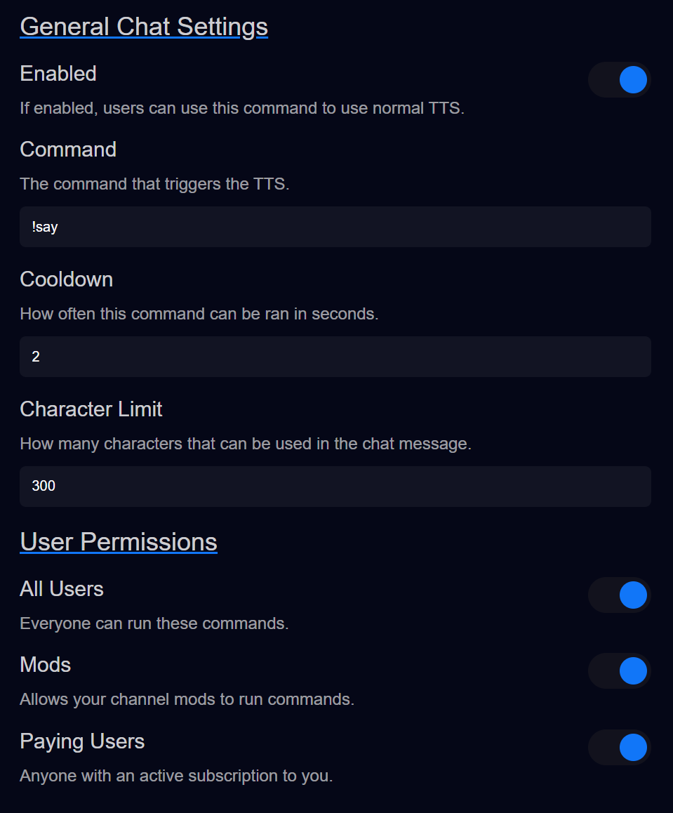

# Chat Settings

### If you're a Twitch streamer, but you're not at least an affiliate, then you can't use redeems.
In comes `Chat Settings`.

There are **two** chat settings on this page.
- General Chat Settings
- ChatGPT Chat Settings

We can ignore `ChatGPT Chat Settings` for now, but if you're curious [go here to learn more.](../chat-gpt/openai-chat-settings.md)

> By default, you as the streamer can always run commands.  
> This should go without saying...

Here's all our settings!
- `Enabled` - Obviously, if this is ticked on, then it can be used!
- `Command` - You can make the command be anything you want. This is what users will type to run the command.
- `Cooldown` - If you want to limit how often the command be spammed, set this number.
- `Character limit` - This limits how much text will be read from the users message.
- `Permissions` - Configure who can use these commands.
  - `All Users` - If this is set, you don't need to set the others, anyone can use the command.
  - `Mods` - If you only want your mods to be able to use the commands.
  - `Paying Users` - If you want users with active subscriptions to be able to use the commands.

