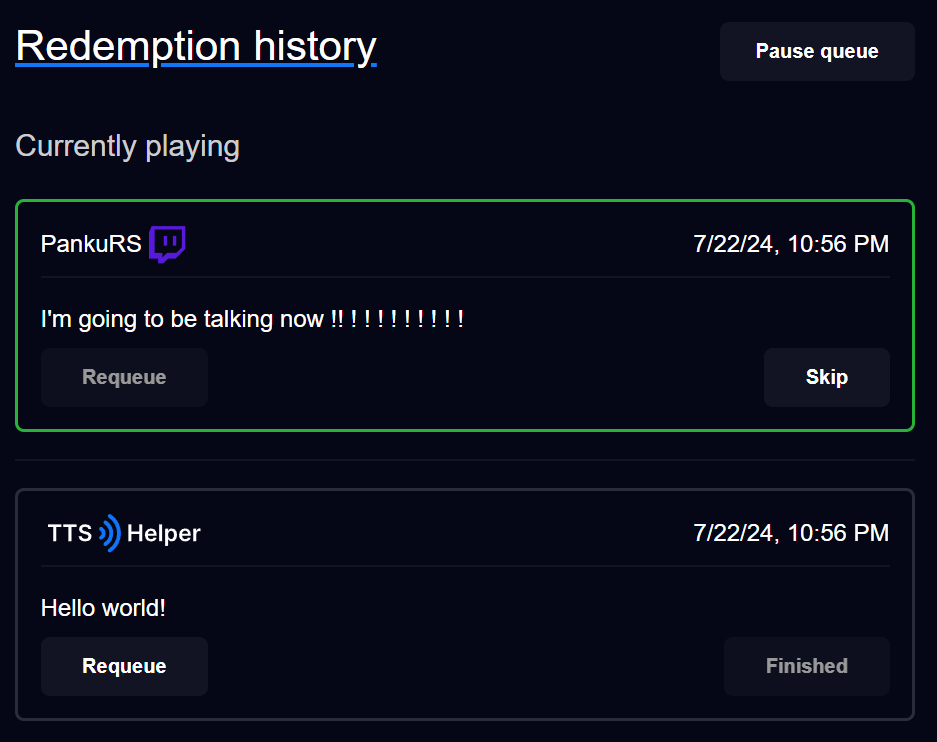
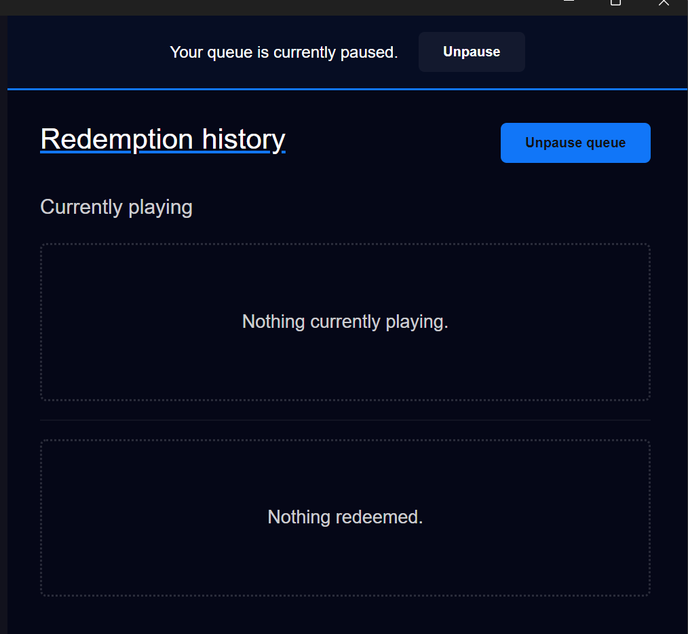

# History / Queue

If you want to monitor or review the TTS history while you're streaming, or after, you can go to the history page `Text to Speech > History`.

The history page shows what's currently playing (if anything is) and what has already played.

You can see which user made the request, the platform it came from, the time, the content and if it finished.

If you ever miss a redeem and want to replay it, just hit the `Requeue` button!

## That's really it for the history page.
If you want, you can pause the queue here. If you have the StreamDeck plugin installed, you can pause and resume the queue with the buttons there too.

If you do pause your queue, this global header will appear! It makes it easy to unpause (and remember to) when on other pages.

