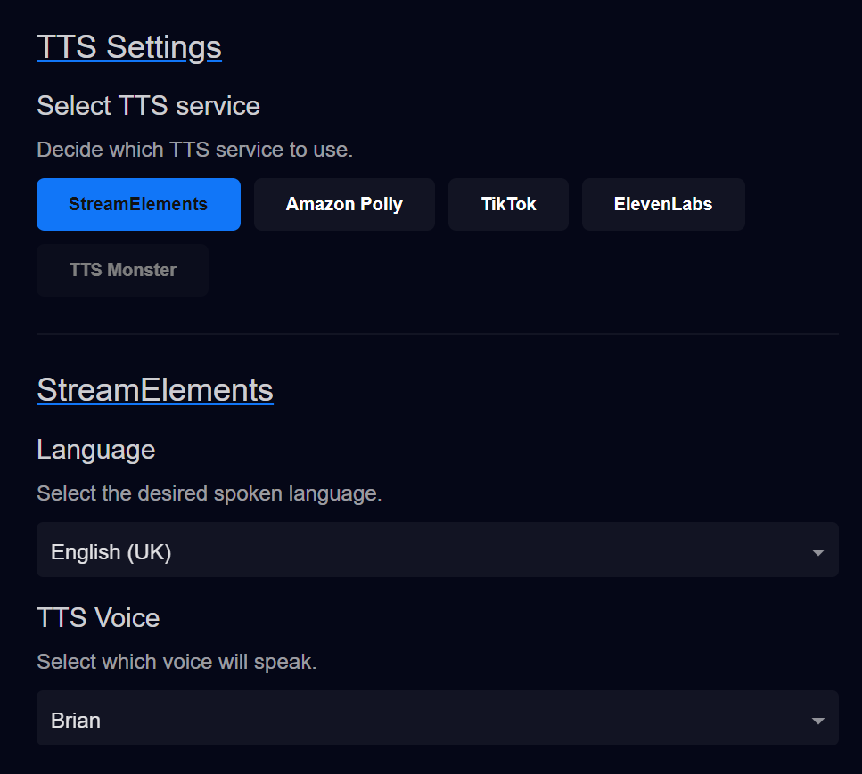
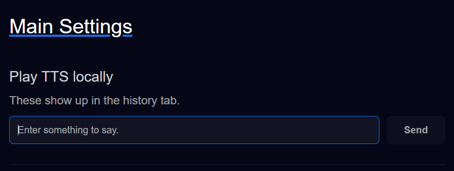

# TTS Services

**TTS Helper** supports **four** TTS services currently.
- StreamElements - A free service powered by... StreamElements.
- TikTok - A free service powered by WeilByte.
- Amazon Polly - A paid (but affordable) service that has all the same options as StreamElements, but better latency.
- ElevenLabs - A paid (quite expensive) service that has _very_ realistic sounding voices. You can train voices too!

## Making some sound (with TTS)
In the side nav look for `Text to Speech` and select `Settings`. (So `Text to Speech > Settings`)   
Scroll to the bottom of the page, you should see some buttons and `StreamElements` should be selected by default.   

You can select your desired `Language` and `TTS Voice`. **TTS Helper** filters each services voices by language. It makes it easier for both you and I.

Now that we made sure you have your desired TTS voice selected, scroll back to the top of the page. 
Type _anything_ into this and press play. You _should_ hear something!

## If you don't hear anything...

There could be a couple things at fault:
- If you see a red popup at the bottom of the screen that says something like `Oops! Couldn't play that TTS!`
  - Make sure there's no firewalls blocking **TTS Helper** from making outward request.
  - **TTS Helper** only makes outward request to get TTS audio! It can't work if it's being blocked.
- Your default audio device might not be what you expect...
  - On the same page (`Text to Speech > Settings`) you can select the audio device from the dropdown. Try changing this and playing more.