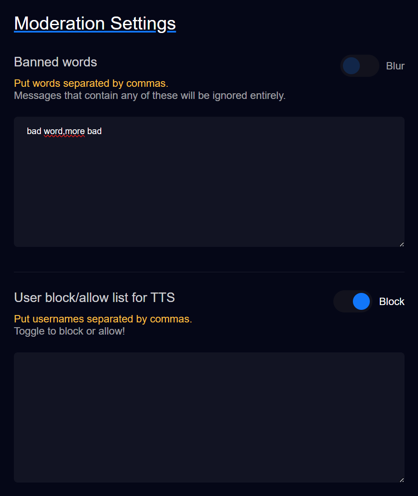

# Moderation

**TTS Helper** offers some "basic" moderation tools to make sure your TTS experience goes smoothly.

The moderation page has a `banned words` input and a `allow / block` input.

## Banned words
**This does not support regex, at least not right now.**

Anything you type into this box will be checked against all TTS request. **Any** request that _contain_ a banned word will be ignored entirely, and the username of the user and their message will be added to the log page.

So if our banned words included `Dog, Cat, Cow` and we had an incoming TTS request:
> Hello! How's your cat?

It would ignore this request!

But we can also ignore phrases. Everything is broken up by commas.  
So if we had `Hello world!` in our banned words list and got a request...
> hello world! how're you doing?

It would also ignore this one!

We automatically blur the banned words list every time you visit the page, just incase you accidentally opened this up on stream.

## Allow / Block list
**Clicking the toggle changes the list from block to allow and vice versa.**

Add usernames to this list separated by commas, simple as. Any request coming in from these users will either be ignored (if blocked) or allowed (if allowed).

