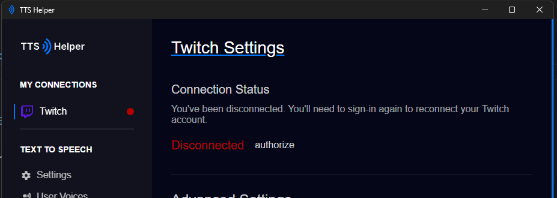
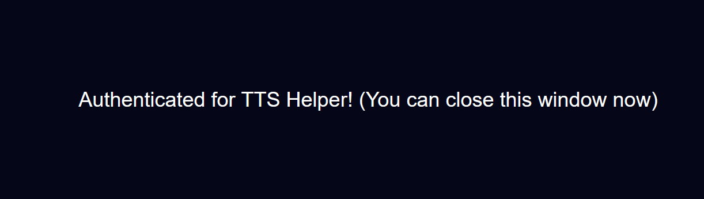
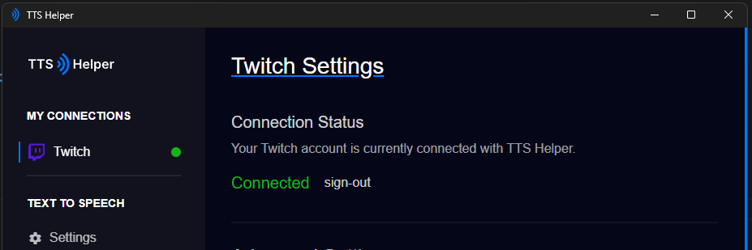

# Twitch auth

Once you've installed TTS Helper, you should login into your **Twitch** account.  
<small>(Because I only support Twitch right now... sorry)</small>

When you login and authorize with **TTS Helper** on **Twitch**, you should be met with this: 

And you should see **Twitch** say it's `Connected`

## And that's all I wrote.
That should be all there is for authenticating with **Twitch**. If you encounter issues, please join the [Discord server](https://discord.com/invite/jNDjNVeuJp)