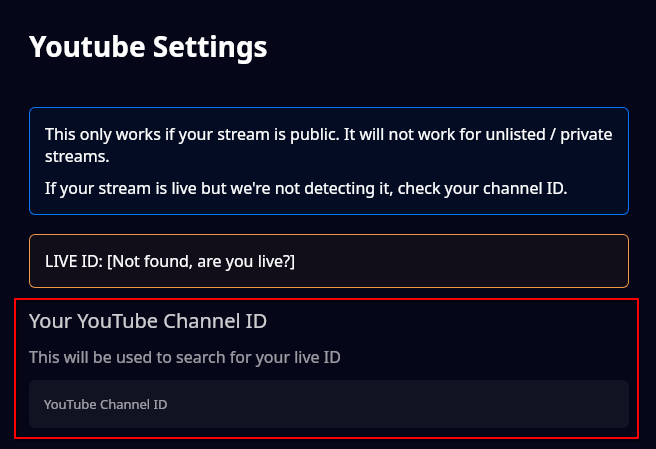

# Youtube Settings

Currently, TTS Helper does not allow you to link to unlisted streams.

**Make sure your Youtube stream is publicly listed, or else TTS Helper will not be able to find your stream.**

> You can find your YouTube channel ID by going to YouTube Studio, clicking on Settings, then Channel, and selecting Advanced settings. Your channel ID will be listed there under Account information.

Once you've set your channel ID, you should see the live ID populate and the Youtube connection will turn green in the sidenav.

Due to the open nature of TTS Helper, the best information we can get for you currently are SuperChats and chat messages.
