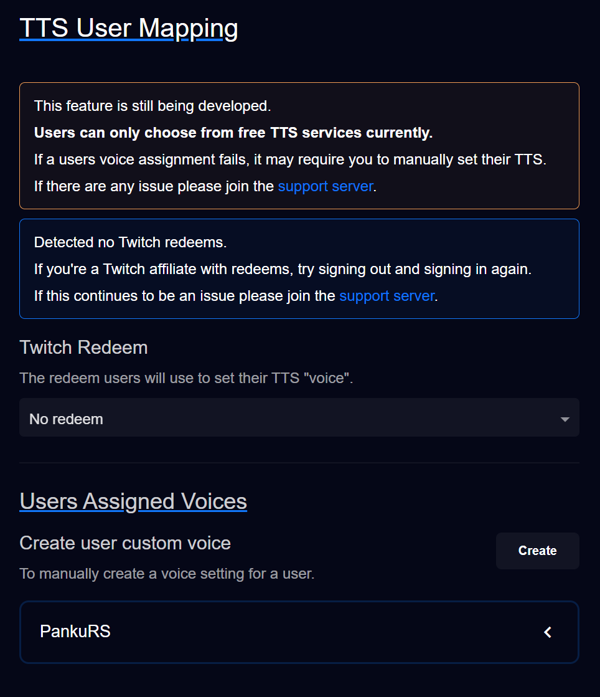
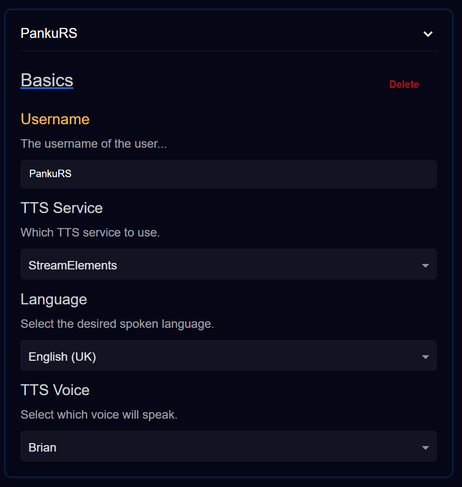

# User Voices

## If you're a user wanting to know what their options are [go here](./user-voices-options.md)

There's a new<small>TM</small> feature in **TTS Helper** that allows users to select what TTS voice will be used when _they_ redeem.    
<small>I envisioned this as a good channel point sink.</small>

**Currently** the only way for users to have a custom TTS voice set for them is either use a **Twitch** redeem you set or you manually setting it for them on the page.

**If** you want users to be able to set their own, they need to follow a specific pattern when using your redeem.
<small>Make sure your redeem allows text input.</small>

## **The values need to be separated with commas**  
Here's an example redeem being used (using /select-tts to mimic a redeem name):
> /select-tts streamelements, english (uk), brian 

This will assign (me) the TTS service, the language, and the TTS voice available in that language.  
If the users wishes to update their

