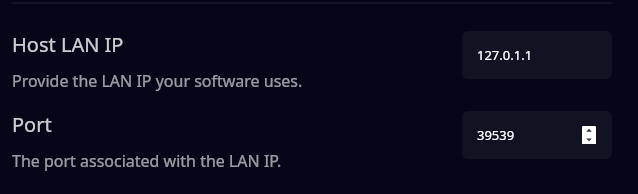
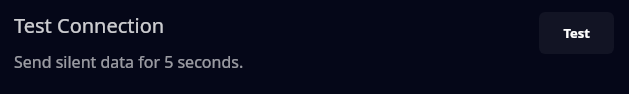
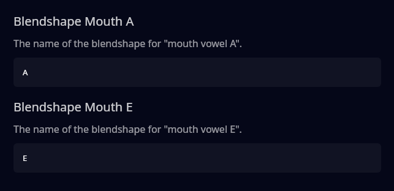
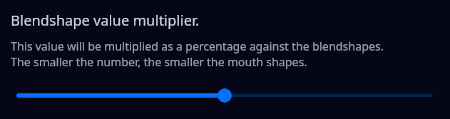

# VirtualMotionCapture Protocol

First and foremost.

**THIS IS NOT USING THE VIRTUALMOTIONCAPTURE SOFTWARE.**

TTS Helper uses the VMC _protocol_. A lot of 3d (vtuber) software support the VMC protocol for receiving / sending data.

> It also appears that if you use a VRM model, VRM version 1 models don't work, but VRM version 0 models do.

But try it out and let us know anyway!

## How to setup TTS Helper to send VMC data

Depending on the software you use, your LAN IP and port may be different.

Typically, the port will be between `39539 - 39541`, but change it to whatever the software you use provides.

## Testing the connection

Once you've decided your information is right, you want to test that TTS Helper is sending the blendshape data properly to your software.

When you push `Test`, TTS Helper will send **random**, **silent**, mouth shapes for 5 seconds.

**If you do not see the models mouth moving, you may need to [change the blendshape names](./virtual-motion-capture-protocol.md#mouth-blendshapes).**

## Mouth Blendshapes.

Due to how TTS Helper generates mouth shape data, we only send "mouth open" and "mouth form".

So it's easier for us to just send `A` and `E` as the "open" and "form".

However, if you have a model in 3d and another model to be the TTS avatar, the rigger for the model might not have left the mouth blendshape parameters as the default `A` and `E`.

Here, you're able to change where TTS Helper sends data for `A` and `E`. 

## **Does the mouth look too open or too closed?**

If you're having issues with the mouth blendshapes looking too small / large, we've added a slider for you to mess with to get the right feel.

`100` means `100%` of the value sent, which is the default. So if the mouth looks like it's not opening enough, you may set it to `150` to make it larger.

